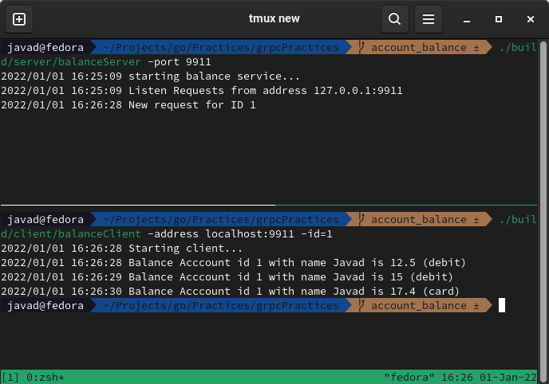

# Account Balance Service gRPC 

Account balance service is server-side stream get balance account by id

## Build

- `make clean`

## Run and test

- run server = `./build/server/balanceServer -port 9911`
- run client = `./build/client/balanceClient -address localhost:9911 -id 1`
